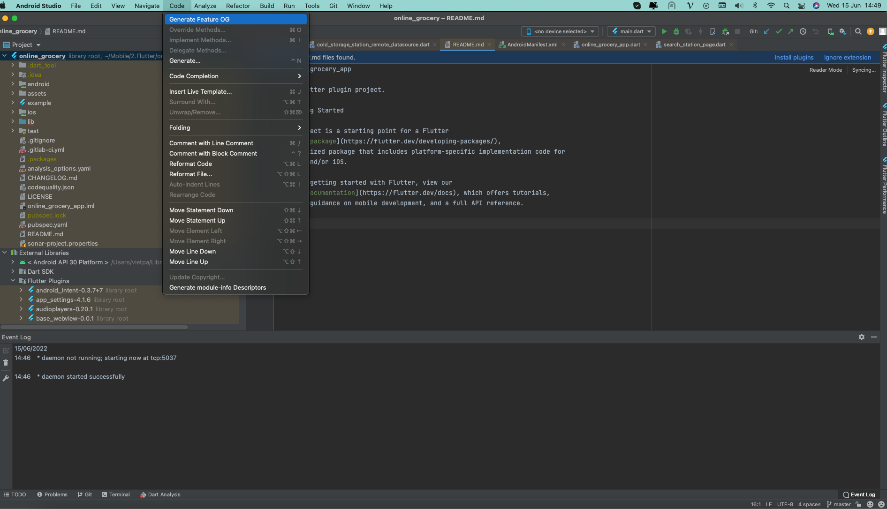

# Android Studio Plugin to generate Clean Architect template for Flutter Project

This project is a Kotlin version of [plugin-utils](https://github.com/nguyencse/plugin-utils)

## Features

- Generate files and folders based on Clean Architect template from [Resocoder Blog](https://resocoder.com/2019/08/27/flutter-tdd-clean-architecture-course-1-explanation-project-structure/)

## How To Use
    
    
